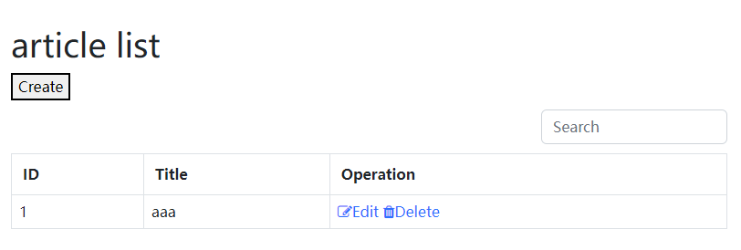
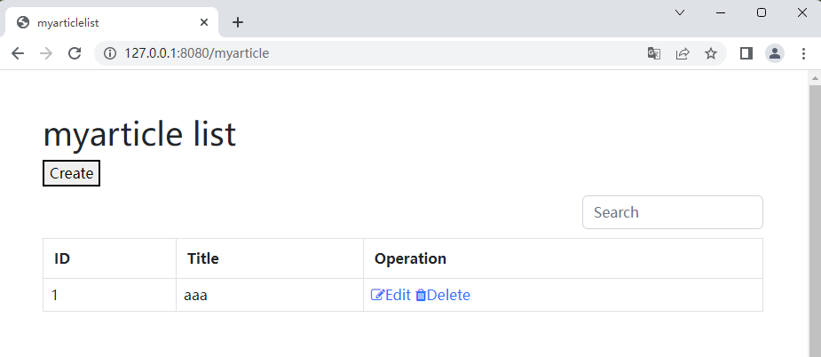
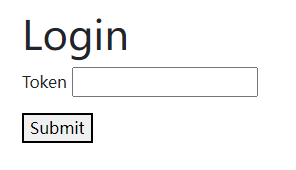
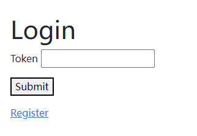
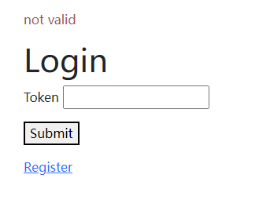
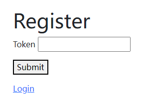
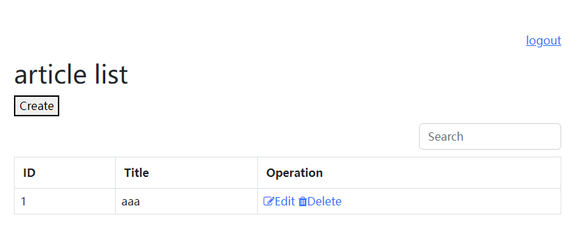

# gorestful

用函数直接生成前后端分离的restful框架，并且启动服务。

很多情况下，golang都用于进行后端开发，最多配置一个api接口，但是如果我们想要进行一些页面的展示，就会比较痛苦，需要写一些前端页面，做前后端分离，这时对于后端人员而言时间大量浪费在了基础前端知识。如果有一个框架，能够自动生成后端model对应的view，就能比较快的让后端程序员回归到业务本身。先完成流程，再优化界面。

满足如下前提：
- 直接生成gorm对应的模型的restful api
- 可选直接生成对应的增删改查页面
- 内嵌到golang二进制文件中
- 做快速的概念验证，而不是完善所有的界面

## features
- [ ] 支持后端api生成
  - [x] 列表
    - [x] 支持搜索
  - [x] 查看详情
  - [x] 删除
  - [x] 修改
  - [x] 新增
  - [x] 字段配置显示
    - [x] 支持自动提取字段列表
      - [x] 识别gorm.model
      - [x] 识别json tag，解决大小写的问题
      - [x] 识别sql.NullTime，解决空值的问题
      - [x] 识别enum类型的数字
      - [x] 提取是否允许空值
      - [ ] 识别指针结构，不应该加载
    - [x] 支持字段黑名单，主要解决在自动提取的情况下排除少数字段的问题
    - [ ] 支持自定义格式
    - [x] 支持bool类型字段的更新（默认情况下false作为空值不能更新到数据库）
  - [x] 支持认证
    - [x] 内嵌自动生成表单的认证
    - [ ] 支持跳转到第三方的认证
    - [x] 支持且只支持header头带认证信息
  - [x] 支持权限控制，上层通过GetDb来控制，包括where条件，joins联合查询等
  - [x] 支持事件通知
    - [x] 支持插入数据事件通知
  - [x] 支持自定义query回调，主要用与在joins场景下的多表条件（WithQueryFunc）
- [ ] 支持前端页面生成
  - [x] 列表
    - [x] 支持搜索
  - [x] 新增
    - [x] 自动处理整型
      - [x] 自动处理int/uint/int64类型
      - [x] 自动处理bool类型，对应select
  - [x] 修改
  - [x] 删除
  - [ ] 详情
  - [x] 字段配置显示（由后端配置决定）
  - [x] 支持认证
  - [ ] 支持权限控制
  - [x] 倒序排列
  - [x] 分页
  - [x] 错误提示
  - [x] 空值提示必填，且自动聚焦

## 使用方法：
### 最简单的使用
- 没有用户体系，直接显示列表，参考[examples/simple.go](examples/simple.go)
  

### 绑定到不同的url路径
- 没有用户体系，自定义路径显示列表，参考[examples/simple_with_uri.go](examples/simple_with_uri.go)
  

### 内嵌用户认证
这里只有认证的概念没有授权的概念，也就是说用户等级是一样的，资源并不会绑定到特定用户：
- 正确的用户才能显示列表，参考[examples/auth_no_register.go](examples/auth_no_register.go)
  
- 正确的用户才能显示列表，且开放注册，参考[examples/auth_with_register.go](examples/auth_with_register.go)
  
  
  
  
- jwt的方式，参考[examples/resource_with_privilege.go](examples/resource_with_privilege.go)

### 资源授权访问
R是资源，U是用户，有一个关联表绑定了R<->U，这时候就要进行联合查询和权限判断，只显示当前用户的内容：
- 有权限用户才能显示列表，参考[examples/resource_with_privilege.go](examples/resource_with_privilege.go)